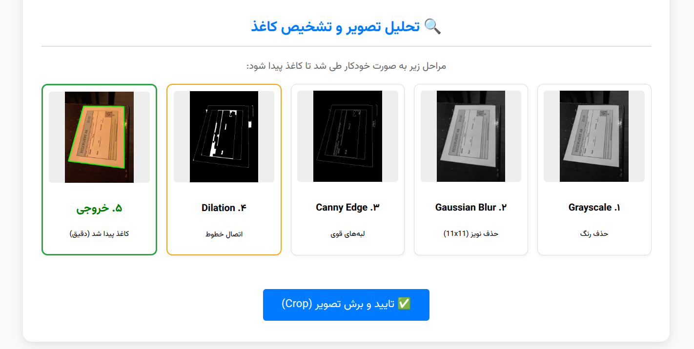

# 📄 Intelligent Document Scanner

A robust web-based document scanner application built with **Python (Flask)** and **OpenCV**.

This project simulates the functionality of mobile scanning apps (like CamScanner) but provides a **"Glass Box"** experience, visualizing every step of the image processing pipeline. It is designed to handle real-world challenges such as **glare, shadows, and finger occlusion**.

!(screenshots/demo.png)



*(Note: Replace this link with a screenshot of your UI if available)*

## ✨ Key Features

* **🔍 Robust Paper Detection:**
    * Utilizes **Morphological Closing** to bridge gaps in edges caused by bright light or glare.
    * Implements **Convex Hull** techniques to handle edge occlusions (e.g., fingers holding the paper).
* **👁️ Process Visualization:**
    * Displays the internal computer vision pipeline: Grayscale → Gaussian Blur → Canny Edge Detection → Morphological Operations → Final Contours.
* **📐 Automatic Perspective Correction:**
    * Detects the document corners and applies a 4-point perspective transform to generate a flat, top-down view.
* **🎨 Professional Filters:**
    * **Magic Color:** Enhances vibrancy and saturation using the HSV color space (similar to vivid mode).
    * **B&W Scan:** Produces a clean, high-contrast monochrome document using Adaptive Thresholding and Denoising.
* **🔄 Post-Processing Tools:**
    * Manual 90-degree rotation.
    * One-click download of the final result.

## 🛠️ Tech Stack

* **Backend:** Python 3, Flask
* **Computer Vision:** OpenCV (`cv2`), NumPy
* **Frontend:** HTML5, CSS3, JavaScript (Vanilla)

## ⚙️ Installation & Usage

1.  **Clone the repository:**
    ```bash
    git clone https://github.com/nadimnikzai/document_scanner.git
    cd YOUR_REPO_NAME
    ```

2.  **Install dependencies:**
    It is recommended to use a virtual environment.
    ```bash
    pip install flask opencv-python-headless numpy
    ```

3.  **Run the application:**
    ```bash
    python app.py
    ```

4.  **Open in Browser:**
    Go to `http://127.0.0.1:5000/` in your web browser.

## 🧠 How It Works (The Algorithm)

The core logic is divided into modular stages inside the `utils/` directory:

### Stage 1 & 2: Preprocessing & Contour Detection
To find the document amidst noise and background clutter:
1.  **Noise Reduction:** Applies `GaussianBlur` (kernel 11x11) to smooth out texture noise.
2.  **Edge Detection:** Uses `Canny` edge detection with dynamic thresholds based on image median intensity.
3.  **Gap Filling (Crucial Step):** Applies **Morphological Closing (`MORPH_CLOSE`)**. This connects broken edge lines caused by glare or weak contrast.
4.  **Shape Approximation:**
    * Finds contours and approximates them to polygons.
    * If a perfect 4-sided polygon isn't found, it calculates the **Convex Hull** to ignore indentations (like a finger covering the edge) and retries detection.

### Stage 3: Perspective Warp
Once the 4 corners are identified:
1.  Points are ordered (Top-Left, Top-Right, Bottom-Right, Bottom-Left).
2.  The maximum width and height are calculated using Euclidean distance.
3.  A **Homography Matrix** is computed to map the skewed document to a flat rectangle.

### Stage 4: Post-Processing Filters
* **B&W Filter:** Uses `cv2.divide` (to remove shadows/illumination patterns) followed by `Otsu` thresholding.
* **Magic Color:** Converts the image to **HSV** space, boosts the **Saturation (S)** channel by 50%, and applies CLAHE (Contrast Limited Adaptive Histogram Equalization) to the Value channel.

## 📂 Project Structure